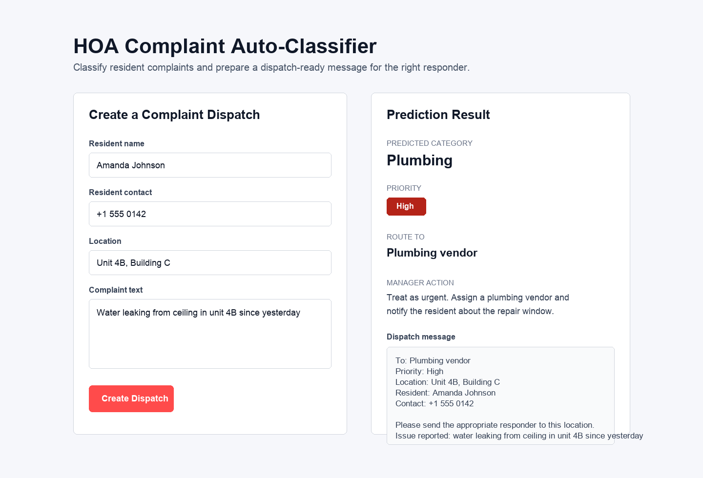

# HOA Complaint Auto-Classifier

An NLP-based complaint classification app that reads an HOA maintenance complaint and predicts its category, urgency, and responsible responder. It also generates a dispatch-ready message containing the resident details, location, issue, and routing instructions so the complaint can be sent to the right maintenance team quickly.

## Problem It Solves

PropVIVO manages multiple HOA communities where residents submit maintenance complaints in plain English. Operations managers otherwise need to manually read each complaint, decide whether it is plumbing, electrical, elevator, landscaping, cleanliness, or security related, estimate urgency, and contact the right responder.

This project automates that first triage step so complaints can move faster from resident report to service dispatch.

## UI Preview



## Features

- Classifies complaints into `Plumbing`, `Electrical`, `Elevator`, `Landscaping`, `Cleanliness`, or `Security`
- Assigns priority as `High`, `Medium`, or `Low`
- Routes each complaint to the correct responder, such as a plumber, electrician, janitorial team, or security team
- Generates a dispatch-ready message with resident name, contact, location, complaint details, and priority
- Keeps ML logic separate from the Streamlit UI using modular Python files

## Tech Stack

- Python
- Streamlit
- pandas
- scikit-learn
- TF-IDF Vectorization
- Logistic Regression
- joblib

## How To Run

The trained model is already saved in the project, so the app can be launched directly:

```bash
streamlit run app.py
```

Then open the local URL shown in the terminal.

## Project Structure

```text
.
├── app.py
├── data/
│   └── complaints.csv
├── docs/
│   └── ui-screenshot.png
├── models/
│   └── complaint_classifier.joblib
├── requirements.txt
└── src/
    ├── data_loader.py
    ├── model.py
    └── predict.py
```

## Module Responsibilities

- `data_loader.py`: Loads the complaint dataset and preprocesses text
- `model.py`: Trains the TF-IDF and Logistic Regression classifiers
- `predict.py`: Loads the trained model and exposes prediction plus dispatch-message functions
- `app.py`: Provides the Streamlit interface and calls only the prediction layer

## Example Output

For the complaint:

```text
Water leaking from ceiling in unit 4B since yesterday
```

The app can produce:

```text
Category: Plumbing
Priority: High
Route To: Plumbing vendor
```

And generate a dispatch message that can be sent to the maintenance responder.
